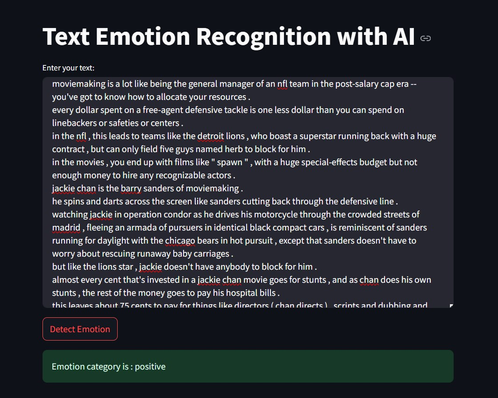

Text Emotion Recognization software using AI

Text sentiment recognition software based on user input text

Using a combination of neural networks RNN, CNN and Embeding method
Using Python, Tensorflow, keras, NLTK

There are two web user environments (Streamlit) and web environment for this software.

